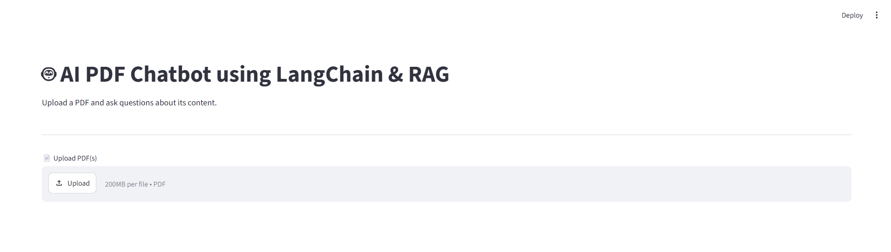
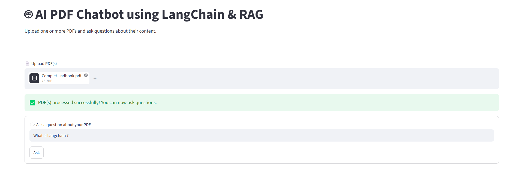
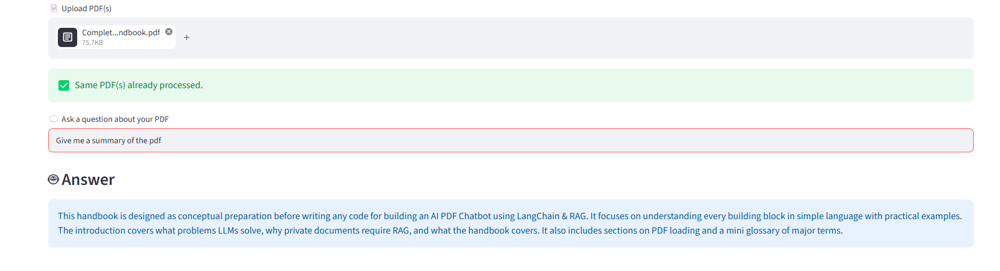
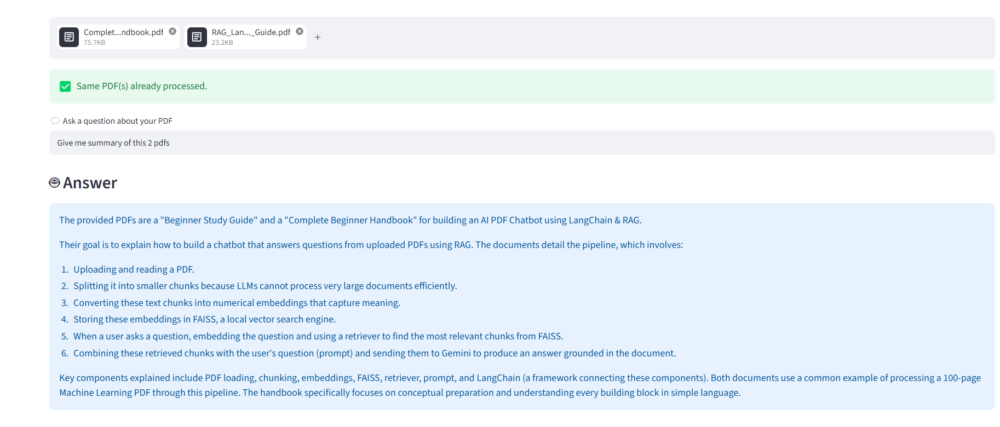
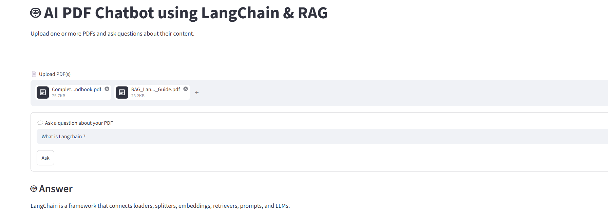

# 🤖 AI PDF Chatbot using LangChain & RAG


A beginner-friendly AI-powered PDF Question Answering application built with **Python**, **LangChain**, **Google Gemini**, **FAISS**, **Hugging Face Embeddings**, and **Streamlit**.

The application allows users to upload one or more PDF documents, processes them using a Retrieval-Augmented Generation (RAG) pipeline, and answers questions based only on the uploaded documents.

Instead of sending the entire PDF to the Large Language Model (LLM), the application retrieves only the most relevant sections of the document and provides them as context to Gemini, making responses faster, more accurate, and less prone to hallucinations.

---

## ✨ Features

- 📄 Upload one or more PDF files
- 📚 Extract text from PDFs
- ✂️ Split documents into meaningful chunks
- 🧠 Generate semantic embeddings using Hugging Face
- 🗂️ Store embeddings in a FAISS vector database
- 🔍 Retrieve the most relevant document chunks
- 🤖 Generate context-aware answers using Google Gemini
- 🌐 Interactive Streamlit web interface
- ⚡ Beginner-friendly modular project structure
- 🔒 API key stored securely using `.env`

---

## 🛠️ Tech Stack

| Technology | Purpose |
|------------|---------|
| Python | Programming Language |
| Streamlit | Web Application |
| LangChain | RAG Framework |
| Google Gemini API | Large Language Model |
| Hugging Face Embeddings | Text Embeddings |
| FAISS | Vector Database |
| PyPDF | PDF Reading |
| python-dotenv | Environment Variable Management |

---

## 📁 Project Structure

```text
ai-chatbot-using-rag-langchain/
│
├── assets/
│   └── screenshots/
│
├── pdfs/
├── faiss_index/
├── utils/
│   ├── pdf_processor.py
│   ├── vector_store.py
│   └── chatbot.py
│
├── app.py
├── requirements.txt
├── README.md
├── .gitignore
└── .env
```

---

## 🔄 RAG Pipeline

```text
Upload PDF(s)
      │
      ▼
Read PDF
      │
      ▼
Extract Text
      │
      ▼
Split into Chunks
      │
      ▼
Generate Embeddings
      │
      ▼
Store in FAISS
      │
      ▼
User asks Question
      │
      ▼
Convert Question to Embedding
      │
      ▼
Similarity Search
      │
      ▼
Retrieve Relevant Chunks
      │
      ▼
Send Context + Question to Gemini
      │
      ▼
Generate Final Answer
```

---

## ⚙️ Installation

### 1. Clone the Repository

```bash
git clone https://github.com/YOUR_GITHUB_USERNAME/ai-chatbot-using-rag-langchain.git
```

### 2. Navigate to the Project Folder

```bash
cd ai-chatbot-using-rag-langchain
```

### 3. Create a Virtual Environment

**Windows**

```bash
python -m venv .venv
```

Activate it:

```bash
.venv\Scripts\activate
```

**macOS / Linux**

```bash
python3 -m venv .venv

source .venv/bin/activate
```

### 4. Install Required Packages

```bash
pip install -r requirements.txt
```

---

## 🔑 Environment Variables

Create a `.env` file in the project root and add your Google Gemini API key.

```env
GOOGLE_API_KEY=YOUR_API_KEY
```

You can obtain an API key from **Google AI Studio**.

> **Important:** Never upload your `.env` file or API key to GitHub.

---

## ▶️ Run the Application

Start the Streamlit server using:

```bash
streamlit run app.py
```

The application will automatically open in your default browser.

If it doesn't open automatically, visit:

```
http://localhost:8501
```

---

## 📖 How to Use

1. Launch the Streamlit application.
2. Upload one or more PDF files.
3. Wait for the application to process the documents.
4. Enter a question related to the uploaded PDFs.
5. The application retrieves the most relevant information using FAISS.
6. Google Gemini generates an answer using only the retrieved context.
7. Read the generated answer directly in the Streamlit interface.

---

## 📸 Application Screenshots

### 1. Home Page

Shows the initial interface where users can upload one or more PDF files.



---

### 2. Processing Uploaded PDFs

After selecting the PDF files, the application extracts text, creates chunks, generates embeddings, and builds the FAISS vector database.


---

### 3. PDFs Processed Successfully

After processing is complete, the chatbot is ready to answer questions from the uploaded documents.


---

### 4. Asking a Question

The user enters a natural language question related to the uploaded PDFs.



---

### 5. Answer from a Single PDF

The chatbot retrieves the most relevant chunks from the uploaded document and generates a context-aware answer using Google Gemini.



---

### 6. Summary of Multiple PDFs

The application combines information from multiple uploaded PDFs and generates a unified summary.



---

### 7. Question Answering Across Multiple PDFs

The chatbot retrieves relevant information from multiple uploaded documents and answers knowledge-based questions using Retrieval-Augmented Generation (RAG).



---

## 🚀 Future Improvements

- Support chat history
- Add conversation memory
- Display page numbers with answers
- Highlight the source text used to generate answers
- Support additional document formats (Word, TXT, PPT)
- Deploy the application online
- Add authentication for multiple users
- Improve retrieval using Hybrid Search
- Add streaming responses for faster user experience

---

## 📚 What I Learned

While building this project, I gained practical experience with:

- Retrieval-Augmented Generation (RAG)
- LangChain fundamentals
- Google Gemini API integration
- Hugging Face sentence embeddings
- Vector databases using FAISS
- Semantic search
- Document chunking strategies
- Prompt engineering
- Streamlit application development
- Modular Python project structure
- Debugging real-world AI applications

---

## 💡 Interview Questions

This project helped me understand and explain:

- What is Retrieval-Augmented Generation (RAG)?
- Why can't an LLM directly answer questions from private PDFs?
- Why do we split documents into chunks?
- What are embeddings?
- Why do we use a vector database?
- What is FAISS?
- Why use LangChain?
- Why is semantic search better than keyword search?
- What happens internally when a user asks a question?
- Why do we use Prompt Templates?

---

## 📄 License

This project is intended for educational and portfolio purposes.

---

## 👨‍💻 Author

**Pranav Panjabi**

- GitHub: https://github.com/PRANAVPANJABI
- LinkedIn: https://www.linkedin.com/in/pranavkumar-panjabi-a16257190/